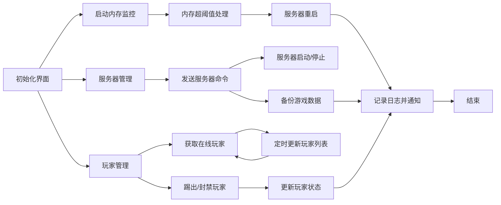

# Palworld-server-protector-DotNet
【新】GUI版本 Palworld服务端进程守护+内存监控+优雅重启+自动存档+Rcon
（for windows）

注意：protector-electron（旧版）已弃用

欢迎反馈bug，可提交issues或者扫码进群（添加机器人后发送Palworld即可）

## 	:beers:功能

- 服务器配置文档(.ini)可视化编辑【New】
- Webhoot通知推送(企业微信机器人)【New】

- 内存监控（自定义阈值触发）
- 进程守护（当前如果没有服务端运行就自动重启）
- 优雅重启（内存占用达到阈值后自动发送公告并关服等待重启）
- 自动备份存档
- 轮询获取在线玩家
- Rcon指令

## 	:bangbang:注意
- 本GUI版本复刻了命令行版本（[https://github.com/KirosHan/Palworld-server-protector](https://github.com/KirosHan/Palworld-server-protector)）所有功能
- 旧GUI版（electron）由于占用内存过高已弃用并不再维护
- 本工具大部分功能基于Rcon实现，所以使用需要提前配置服务端启用Rcon和管理员密码（如果配置不生效，也请留意steamapps/common/PalServer/Pal/Saved/SaveGames/0/.../WorldOption.sav）

## :eyes:效果图

## :page_facing_up:使用方法
[https://github.com/KirosHan/Palworld-server-protector-DotNet/wiki](https://github.com/KirosHan/Palworld-server-protector-DotNet/wiki)

## 	:airplane:直接下载（懒人专属）
更新时间：2024-02-05

Latest版本：V2.6.6(1)

* 使用Json保存配置文件(兼容读取原有的Ini配置文件)

* 修改了玩家列表比较方式，现在只比较玩家Name，即使ID获取错误的情况也视为同一玩家

* 修复了服务器名字中含有空格时无法正确获取的情况

=-=- V2.6.5(1) -=-=

* Bug fixed：修复了由于缓存文件占用导致备份失败的问题（包括备份内容错误）

* Fixed：当获取不到玩家steamid的情况下，也会统计到在线列表中（steamid留空）

=-=- V2.6.3(1) -=-=

- 添加了webhook玩家动态(上线/下线)通知，需配置并开启Rcon以及webhook功能

* 更详尽的错误日志
* 重构了Rcon模块
* 更多采用异步方法，避免阻塞UI线程造成界面卡顿

=-=-V2.5.3(2) -=-=

- 添加了webhook的推送选择项
* 修复了最小化后无法启动窗体的bug

=-=- V2.5.2(1) -=-=

- UI调整，添加监控台
- Webhook添加钉钉机器人支持
- 优化备份存档功能逻辑
- 运行状态保存，重启时自动加载上次关闭时状态
- Webhook支持推送在线人数
- 添加任务栏通知

=-=- V2.4.1(1) -=-=

- 添加Webhook推送功能，目前仅支持企业微信群机器人，其他数据格式正在收集中，欢迎提供。

=-=- V2.3.0(1)-=-=

- 新增服务端配置文件可视化编辑（.ini）

=-=- V2.2.0(1) -=-=

- 新增配置保存功能，不用每次打开重新配置了
- 新增Rcon的kick和ban命令
- 新增错误日志输出
- 修改了参数启动的方式，现在可以自由修改

[https://github.com/KirosHan/Palworld-server-protector-DotNet/releases](https://github.com/KirosHan/Palworld-server-protector-DotNet/releases)

如无法运行，请安装.net 6.0运行环境

## 	:coffee:Star and a Coffee

如果这个仓库对你有用，欢迎点个Star⭐︎

也可以Buy me a coffee☕︎

## 	:computer:编译运行
Visual studio 2022

## 	:crystal_ball:Rcon
本项目Rcon功能模块改编自https://github.com/KTTI465/PalWorld-RCON-GUI

## :sparkles:运行逻辑

## :pill:已知问题
1.受服务端限制，rcon发送的文本中无法保留空格，已自动替换为下划线

2.受服务端限制，rcon无法发送中文

## 	:two_hearts:Contributors

<!-- ALL-CONTRIBUTORS-LIST:START - Do not remove or modify this section -->
<!-- prettier-ignore-start -->
<!-- markdownlint-disable -->
<table>
  <tbody>
    <tr>
      <td align="center" valign="top" width="14.28%"><a href="https://kiros.onbeta.com"> <b>Kiros</b></a> <a href="#infra-KirosHan" title="Infrastructure (Hosting, Build-Tools, etc)">🚇</a> <a href="https://github.com//KirosHan/Palworld-server-protector-DotNet/commits?author=KirosHan" title="Tests">⚠️</a> <a href="https://github.com//KirosHan/Palworld-server-protector-DotNet/commits?author=KirosHan" title="Code">💻</a></td>
      <td align="center" valign="top" width="14.28%"><a href="https://github.com/Vincentzyx"> <b>Vincentzyx</b></a> <a href="https://github.com//KirosHan/Palworld-server-protector-DotNet/commits?author=Vincentzyx" title="Code">💻</a></td>
      <td align="center" valign="top" width="14.28%"><a href="https://github.com/lorenzo93"> <b>Lorenzo Ariemma</b></a> <a href="https://github.com//KirosHan/Palworld-server-protector-DotNet/commits?author=lorenzo93" title="Code">💻</a></td>
    </tr>
  </tbody>
</table>

<!-- markdownlint-restore -->
<!-- prettier-ignore-end -->

<!-- ALL-CONTRIBUTORS-LIST:END -->

## :chart_with_upwards_trend:Star History

<a href="https://star-history.com/#KirosHan/Palworld-server-protector-DotNet&Date">
  <picture>
    <source media="(prefers-color-scheme: dark)" srcset="https://api.star-history.com/svg?repos=KirosHan/Palworld-server-protector-DotNet&type=Date&theme=dark" />
    <source media="(prefers-color-scheme: light)" srcset="https://api.star-history.com/svg?repos=KirosHan/Palworld-server-protector-DotNet&type=Date" />
    
  </picture>
</a>

