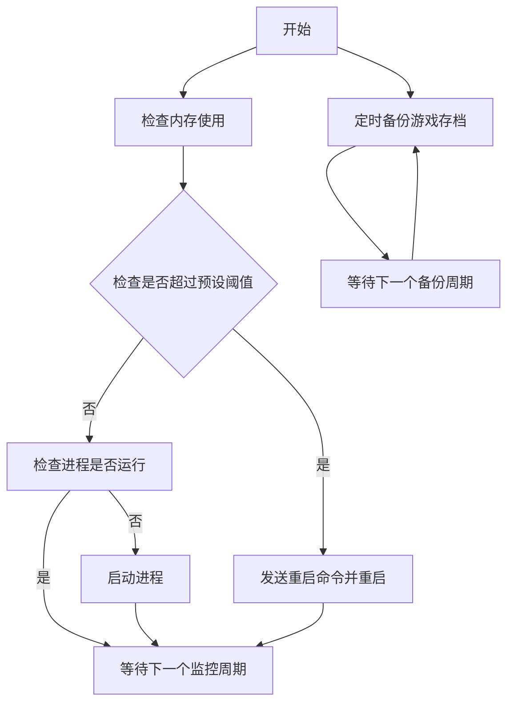

# Palworld-server-protector-DotNet
【新】GUI版本 Palworld服务端进程守护+内存监控+优雅重启+自动存档+Rcon
（for windows）

注意：protector-electron（旧版）已弃用

欢迎反馈bug，可提交issues或者扫码进群（添加机器人后发送Palworld即可）

## 功能
- 内存监控（自定义阈值触发）
- 进程守护（当前如果没有服务端运行就自动重启）
- 优雅重启（内存占用达到阈值后自动发送公告并关服等待重启）
- 自动备份存档
- 轮询获取在线玩家
- Rcon指令
- 服务器配置文档(.ini)可视化编辑【New】
- Webhoot通知推送(企业微信机器人)【New】

## 注意
- 本GUI版本复刻了命令行版本（[https://github.com/KirosHan/Palworld-server-protector](https://github.com/KirosHan/Palworld-server-protector)）所有功能
- 旧GUI版（electron）由于占用内存过高已弃用并不再维护
- 本工具大部分功能基于Rcon实现，所以使用需要提前配置服务端启用Rcon和管理员密码（如果配置不生效，也请留意steamapps/common/PalServer/Pal/Saved/SaveGames/0/.../WorldOption.sav）

## 效果图

## 直接下载（懒人专属）
更新时间：2024-01-29 

版本：V2.4.0

- 添加Webhook推送功能，目前仅支持企业微信群机器人，其他数据格式正在收集中，欢迎提供。

=-=-=-=-=

- 新增服务端配置文件可视化编辑（.ini）

=-=-=-=-=

- 新增配置保存功能，不用每次打开重新配置了
- 新增Rcon的kick和ban命令
- 新增错误日志输出
- 修改了参数启动的方式，现在可以自由修改

[https://github.com/KirosHan/Palworld-server-protector-DotNet/releases](https://github.com/KirosHan/Palworld-server-protector-DotNet/releases)

如无法运行，请安装.net 6.0运行环境

## Star and a Coffee

如果这个仓库对你有用，欢迎点个Star⭐︎

也可以Buy me a coffee☕︎

## 编译运行
Visual studio 2022

## 运行逻辑

## 已知问题
1.受服务端限制，rcon发送的文本中无法保留空格，已自动替换为下划线

2.受服务端限制，rcon无法发送中文

